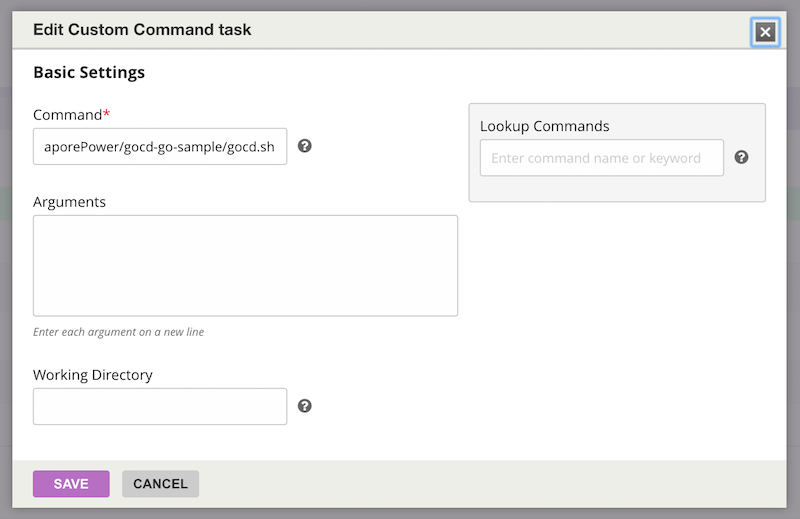
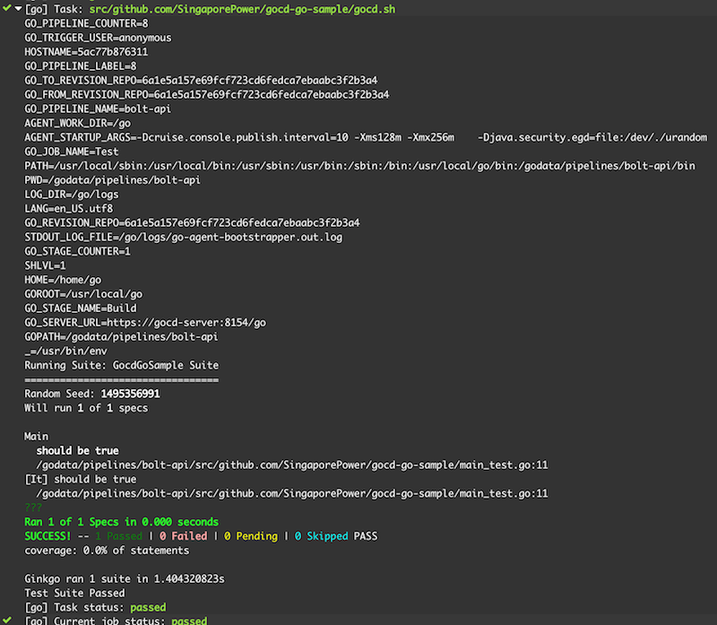

# Sample of GoCD with Go

## GoCD Pipeline Configuration

1. Checkout Git repo material into a `GOPATH` compatible structure:

	Example: `src/github.com/SingaporePower/gocd-go-sample`
	
	

2. In the `Build` stage, add a `Task` to copy `gocd.sh` to the workspace.

	

3. Next `Task` should run `./gocd.sh`

	
	
4. Next run should look like this:

		

## Sample GoCD Config XML

```xml
<?xml version="1.0" encoding="utf-8"?>
<cruise xmlns:xsi="http://www.w3.org/2001/XMLSchema-instance" xsi:noNamespaceSchemaLocation="cruise-config.xsd" schemaVersion="90">
  <server artifactsdir="artifacts" agentAutoRegisterKey="6b2e7f4f-c613-4b56-989d-a3a2bf8c1570" commandRepositoryLocation="default" serverId="94e55ea0-50c3-4b1c-b584-da0a8d760618" />
  <pipelines group="defaultGroup">
    <pipeline name="bolt-api">
      <materials>
        <git url="https://github.com/SingaporePower/gocd-go-sample.git" dest="src/github.com/SingaporePower/gocd-go-sample" materialName="Repo" />
      </materials>
      <stage name="Build">
        <jobs>
          <job name="Test">
            <tasks>
              <exec command="env" />
              <exec command="pwd">
                <runif status="passed" />
              </exec>
              <exec command="go">
                <arg>version</arg>
                <runif status="passed" />
              </exec>
              <exec command="cp">
                <arg>src/github.com/SingaporePower/gocd-go-sample/gocd.sh</arg>
                <arg>.</arg>
                <runif status="passed" />
              </exec>
              <exec command="./gocd.sh">
                <runif status="passed" />
              </exec>
            </tasks>
          </job>
        </jobs>
      </stage>
    </pipeline>
  </pipelines>
  <agents>
    <agent hostname="5ac77b876311" ipaddress="172.18.0.2" uuid="f294016e-d95b-4f76-8a56-fe80f339da85" />
  </agents>
</cruise>
```

## Contributor

- Michael Cheng